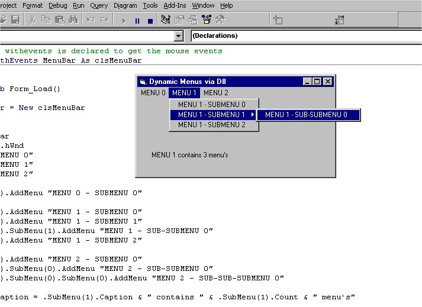



## Create Menu's at runtime via ActiveX dll

### Description

It creates menu's dynamically at runtime, from the menubar itself to menus, and submenus. This is all done via an activex dll, that can be added to any project. The code acts like the treeview control, as if the menu's are nodes for easy application. Full source code for dll included.
 
### More Info
 

             |
---                |---
**Submitted On**   |2002-07-04 16:59:26
**By**             |[NeoBlade](https://github.com/Planet-Source-Code/PSCIndex/blob/master/ByAuthor/neoblade.md)
**Level**          |Intermediate
**User Rating**    |4.7 (56 globes from 12 users)
**Compatibility**  |VB 5\.0, VB 6\.0
**Category**       |[Custom Controls/ Forms/  Menus](https://github.com/Planet-Source-Code/PSCIndex/blob/master/ByCategory/custom-controls-forms-menus__1-4.md)
**World**          |[Visual Basic](https://github.com/Planet-Source-Code/PSCIndex/blob/master/ByWorld/visual-basic.md)
**Archive File**   |[Create\_Men101886742002\.zip](https://github.com/Planet-Source-Code/neoblade-create-menu-s-at-runtime-via-activex-dll__1-36552/archive/master.zip)

